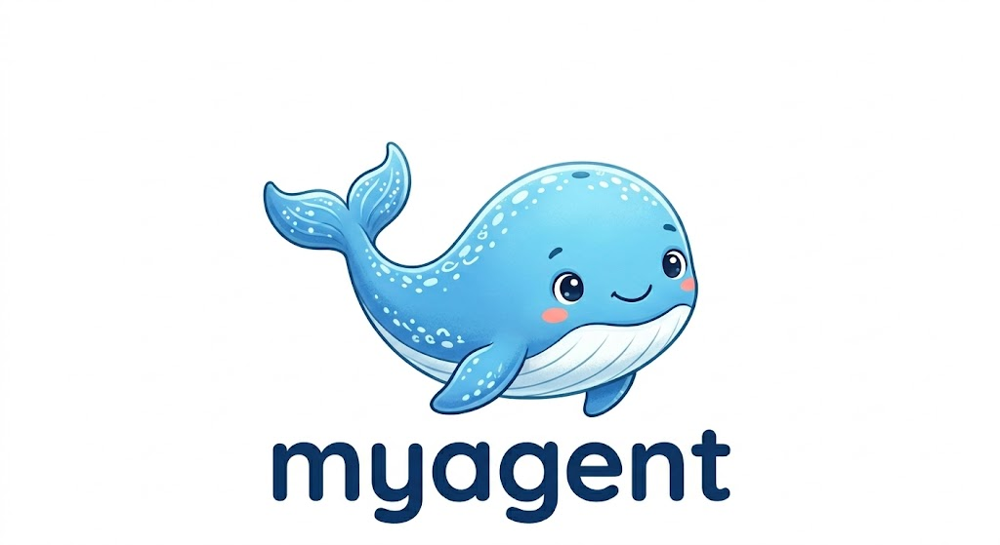

<h1 align="center">myagent</h1>

<p align="center">
  
</p>

<p align="center">
  语言切换: <a href="./README.md">中文</a> | <a href="./README_EN.md">English</a>
</p>

`myagent` 是一个轻量级的命令行智能旅行助手原型。它把用户输入、基于 ReAct 风格的 LLM 推理、外部工具调用和最终答案输出串成了一条非常清晰的链路，适合作为“最小可运行 Agent”示例、教学样板和后续扩展的起点。

## 前言

项目按照“先跑通主流程，再逐步拆分模块”的方式构建：

1. 先提供一个最薄的命令行入口 `user_request.py`，负责读取用户输入并打印最终结果。
2. 再把核心代理循环抽到 `agent/llm_respond.py`，集中处理配置读取、模型调用、输出解析和工具执行。
3. 将系统提示词单独放到 `prompts/agent_system.md`，用来约束模型必须输出 `Thought` 和 `Action`。
4. 最后把实际能力封装到 `skills/weather_skill.py` 中，形成可调用的工具集合。

这样构建的原因：项目使用尽量少的代码，把一个可理解、可调试、可扩展的 Agent 闭环搭起来。方便学习“用户请求如何进入模型、模型如何驱动工具、工具结果如何回流给模型”。

## 项目分析

### 1. 项目结构

```text
myagent/
├── user_request.py
├── agent/
│   └── llm_respond.py
├── prompts/
│   └── agent_system.md
├── skills/
│   └── weather_skill.py
└── .env
```

各模块职责如下：

- `user_request.py`：CLI 入口，读取用户输入，调用 `run_agent()`，打印最终答案。
- `agent/llm_respond.py`：项目核心，负责读取 `.env`、初始化 OpenAI 兼容客户端、执行推理循环、解析模型输出、调用工具。
- `prompts/agent_system.md`：系统提示词，规定模型必须每次只输出一组 `Thought` 和 `Action`。
- `skills/weather_skill.py`：工具层，目前包含天气查询和景点推荐两个能力。

### 2. 从用户输入到 LLM 调用再到输出的完整流程

项目的执行链路可以概括为下面这条主线：

```text
用户输入
  -> user_request.py 读取命令行文本
  -> run_agent(user_prompt)
  -> prompt_history = ["用户请求: ..."]
  -> LLM 根据 system prompt + 历史上下文 生成 Thought/Action
  -> 解析 Action
     -> 如果是 Finish[最终答案]，直接结束
     -> 如果是 tool_name(...)，执行对应工具
  -> 将工具结果包装为 Observation
  -> Observation 追加回 prompt_history
  -> 继续下一轮推理
  -> 最终输出答案
```

更细一点看，核心行为如下：

1. 用户在终端中输入请求。
2. `user_request.py` 调用 `run_agent(user_prompt)`。
3. `run_agent()` 初始化 `prompt_history`，第一条内容是 `用户请求: ...`。
4. `get_llm().generate()` 使用系统提示词 `agent_system.md` 和当前累积的 `prompt_history` 调用模型。
5. 模型必须返回形如下面的内容：

```text
Thought: 我需要先查询这个城市的天气
Action: get_weather(city="Hangzhou")
```

6. 程序用正则表达式解析 `Action`：
   - 如果是 `Finish[...]`，说明模型已经可以直接给出最终答案。
   - 如果是工具调用，就提取工具名和参数。
7. `execute_tool()` 从 `available_tools` 中找到对应函数并执行。
8. 工具返回结果后，程序将其包装成 `Observation: ...`，重新追加到 `prompt_history`。
9. 下一轮模型会同时看到“用户请求 + 上一轮 Thought/Action + Observation”，继续决策下一步。
10. 最终模型输出 `Action: Finish[...]`，程序打印结果并结束。

### 3. 当前实现的关键设计点

- 这是一个典型的 ReAct 单步循环实现。系统提示词明确要求模型每次只能输出一组 `Thought` 和 `Action`，避免一次返回多轮计划。
- `truncate_single_step()` 会主动截断模型意外生成的多组 `Thought/Action`，保证后续解析逻辑不被破坏。
- `OpenAICompatibleClient` 支持通过 `OPENAI_BASE_URL` 对接 OpenAI 兼容接口，而不是只绑定单一服务商。
- `load_settings()` 在模块加载时就会读取 `.env`，意味着配置缺失会在程序启动早期直接暴露出来，而不是等到真正调用模型时才失败。
- `prompt_history` 采用纯文本拼接方式维护上下文，实现简单直观，但不具备结构化对话状态管理能力。
- 当前工具层只有两个工具，所以这个项目更像“可运行的 Agent 骨架”而不是完整旅行平台。

### 4. 工具层的真实工作方式

目前项目只提供两项能力：

- `get_weather(city: str)`：通过 `wttr.in` 查询实时天气，返回天气描述和摄氏温度。
- `get_attraction(city: str, weather: str)`：通过 Tavily Search 搜索“该城市在当前天气下值得去的景点及理由”。

这意味着项目的外部依赖不止 LLM 一项，还包括：

- 一个可访问的 OpenAI 兼容模型接口。
- 一个有效的 Tavily API Key。
- 可访问 `wttr.in` 和 Tavily 服务的网络环境。

### 5. 当前项目的优势与边界

优势：

- 结构小，阅读成本低。
- 从输入到输出的链路非常透明，便于调试和教学。
- 已经完成了“模型推理 + 工具调用 + 观察回流”的核心闭环。
- 能够兼容 OpenAI 风格接口，扩展性比硬编码单一平台更好。

边界：

- 仅支持旅行场景，且只提供天气与景点推荐。
- 工具调用解析目前只支持形如 `key="value"` 的关键字参数格式。
- 没有测试、依赖清单、`.env.example`、日志分级和异常分层。
- 上下文管理靠字符串拼接，复杂任务下可维护性有限。
- `max_steps` 默认是 5，任务稍复杂时可能提前结束。

## 项目配置

### 1. 运行环境

根据当前项目代码，建议使用：

- `Python 3.10+`
- 可联网环境
- 可访问 OpenAI 兼容接口和 Tavily 接口

### 2. 安装依赖

当前仓库里还没有 `requirements.txt` 或 `pyproject.toml`，因此需要手动安装依赖。根据源码中的 import，至少需要下面这些包：

```bash
python3 -m pip install openai python-dotenv httpx requests tavily-python
```

如果你的环境里 `tavily` 模块仍然无法导入，请确认安装的是 Tavily 的 Python SDK。

也可以根据项目 [hello_agent](https://hello-agents.datawhale.cc/#/./chapter1/%E7%AC%AC%E4%B8%80%E7%AB%A0%20%E5%88%9D%E8%AF%86%E6%99%BA%E8%83%BD%E4%BD%93) 进行依赖安装。


### 3. 配置 `.env`

项目会在根目录读取 `.env` 文件。必填项和可选项如下：

```env
OPENAI_API_KEY=your_api_key
OPENAI_BASE_URL=https://api.openai.com/v1
OPENAI_MODEL_ID=gpt-4o-mini
TAVILY_API_KEY=your_tavily_api_key
OPENAI_PROXY_URL=
```

配置项说明：

- `OPENAI_API_KEY`：模型服务的 API Key。
- `OPENAI_BASE_URL`：OpenAI 兼容接口地址。
- `OPENAI_MODEL_ID`：要调用的模型名称。
- `TAVILY_API_KEY`：用于景点搜索的 Tavily Key。
- `OPENAI_PROXY_URL`：可选代理地址；没有代理需求可以留空。

配置注意事项：

- `OPENAI_API_KEY`、`OPENAI_BASE_URL`、`OPENAI_MODEL_ID`、`TAVILY_API_KEY` 缺一不可，否则程序会在启动阶段直接报错。
- `TAVILY_API_KEY` 会被写入当前进程环境变量，以便工具层读取。
- `.env` 中的真实密钥不应提交到公共仓库。

## 项目使用

### 1. 正确的使用顺序

推荐按下面的顺序使用项目：

1. 安装依赖。
根据项目：
2. 在项目根目录配置 `.env`。
3. 运行命令：

```bash
python3 user_request.py
```

4. 在终端提示后输入一个明确的旅行问题，例如：

```text
我想这个周末去杭州旅游，先帮我看看天气，再推荐几个适合当前天气的景点。
```

5. 程序会打印中间推理过程和最终结果。

### 2. 什么样的提问方式更适合当前项目

这个项目目前最适合处理下面这类请求：

- 指定城市的天气查询。
- 基于天气的景点推荐。
- 单城市、单主题、信息链路较短的旅行问题。

更推荐的提问方式是：

- 明确写出城市名。
- 尽量把需求说完整，例如“先看天气，再推荐景点”。
- 避免一次提出多个城市、多天行程、多约束组合的复杂问题。

### 3. 运行时你会看到什么

程序默认会在终端输出：

- `用户输入`
- 当前是第几轮循环
- 模型原始输出
- 工具执行后的 `Observation`
- 最终答案

这对调试非常有帮助，因为你可以直接看到模型到底是怎么决定调用工具的。

### 4. 常见问题

如果运行失败，优先检查下面几项：

- `ModuleNotFoundError: No module named 'openai'`
  - 说明依赖没有安装完成。
- `.env 缺少配置`
  - 说明必填环境变量没有配齐。
- `错误: 调用模型失败`
  - 说明模型接口不可达、密钥错误、代理配置错误或接口不兼容。
- `错误:查询天气时遇到网络问题`
  - 说明 `wttr.in` 不可访问或网络异常。
- `错误:执行Tavily搜索时出现问题`
  - 说明 Tavily Key 或网络存在问题。

## 后言

`myagent` 的价值，不在于它已经做得多大，而在于它已经把 Agent 的最核心闭环跑通了。对于理解“工具调用型智能体”来说，这是一个很好的起点。

如果你把它看作一个“可验证、可解释、可扩展的最小 Agent 工程骨架”，那么这个项目已经完成了第一步，而且方向是对的。
